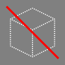

🌐 | [English](./README.md) / [中文](./README-zh-TW.md)

# \[Minecraft Java Data Pack\] No Item Despawn

  
<a href="https://github.com/hugoalh-studio/Minecraft.Java.DataPack.NoItemDespawn"><code>hugoalh-studio/Minecraft.Java.DataPack.NoItemDespawn</code></a>

  
  
  
  
  
  
  

A Minecraft Java Data Pack to prevent item despawn.

<table>
  <tr>
    <td><a href="./LICENSE.md"><b>License</b></a></td>
    <td>MIT</td>
  </tr>
  <tr>
    <td><a href="https://github.com/hugoalh-studio/Minecraft.Java.DataPack.NoItemDespawn/releases"><b>Release</b></a> </td>
    <td>
      <b>Latest:</b>  () 
      <b>Pre:</b>  ()
    </td>
  </tr>
  <tr>
    <td><a href="https://www.curseforge.com/minecraft/customization/no-item-despawn"><b>Release (CurseForge)</b></a></td>
    <td></td>
  </tr>
  <tr>
    <td><a href="https://github.com/hugoalh-studio/Minecraft.Java.DataPack.NoItemDespawn/graphs/contributors"><b>Contributor</b></a> </td>
    <td><ul>
        <li><a href="https://github.com/hugoalh-studio">hugoalh Studio</a></li>
        <li><a href="https://github.com/hugoalh">hugoalh</a></li>
    </ul></td>
  </tr>
  <tr>
    <td><a href="https://github.com/hugoalh-studio/Minecraft.Java.DataPack.NoItemDespawn/issues?q=is%3Aissue"><b>Issue</b></a></td>
    <td> : </td>
  </tr>
  <tr>
    <td><a href="https://github.com/hugoalh-studio/Minecraft.Java.DataPack.NoItemDespawn/pulls?q=is%3Apr"><b>Pull Request</b></a></td>
    <td> : </td>
  </tr>
</table>

## 📜 Description

*This is a reborn project of NoItemDespawn (Forge Modification) and rewrote code for better performance.*

Have you cry because you cannot pick up all of the items in time after death? Have you loss any important item because of item despawn? Now, this data pack solved these problems!

Unfortunately, this data pack still cannot solve item drop to the void, lava, fire, or by explosion...

### ⚠ Important

- This data pack is not recommended to execute on a low performance device!
- User has their own responsibility to undertake the risk of lag/crash/damage on their device, author have no any responsibility to undertake those risk.
- If the world has too many items, it can cause lag/crash!

## 📚 Guide

- [Minecraft Java: Installing a data pack](https://minecraft.gamepedia.com/Tutorials/Installing_a_data_pack)
